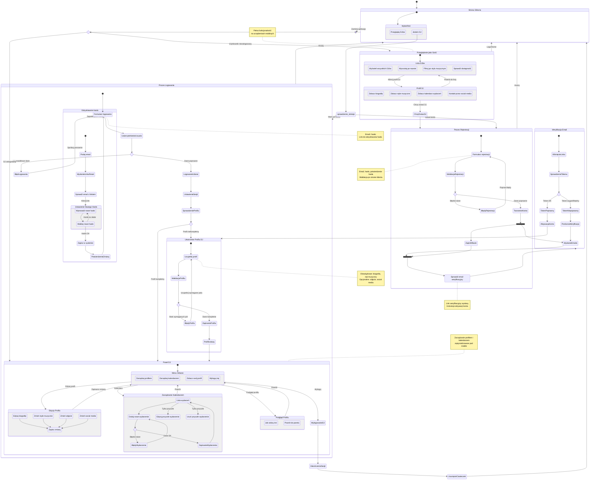

# User Journey Diagram - Techno Ambassador Authentication

```mermaid
stateDiagram-v2
    [*] --> StronaGlowna

    state "Strona Główna" as StronaGlowna {
        [*] --> WybórRoli
        state WybórRoli {
            PrzeglądajDJ: Przeglądaj DJów
            JestemDJ: Jestem DJ
        }
    }

    state sprawdzenie_auth <<choice>>
    StronaGlowna --> sprawdzenie_auth

    sprawdzenie_auth --> PrzeglądanieGość: Użytkownik niezalogowany
    sprawdzenie_auth --> PanelDJ: DJ zalogowany

    %% Ścieżka gościa - przeglądanie bez rejestracji
    state "Przeglądanie jako Gość" as PrzeglądanieGość {
        [*] --> ListaDJów

        state "Lista DJów" as ListaDJów {
            WyświetlListe: Wyświetl wszystkich DJów
            WyszukajDJ: Wyszukaj po nazwie
            FiltrujStyl: Filtruj po stylu muzycznym
            FiltrujDostępność: Sprawdź dostępność
        }

        ListaDJów --> ProfilDJ: Kliknij profil DJ

        state "Profil DJ" as ProfilDJ {
            WyświetlBiografie: Zobacz biografię
            WyświetlStyle: Zobacz style muzyczne
            WyświetlKalendarz: Zobacz kalendarz wydarzeń
            KontaktSocial: Kontakt przez social media
        }

        ProfilDJ --> ListaDJów: Powrót do listy
        ProfilDJ --> ChcęZostacDJ: Chcę zostać DJ
    }

    %% Przejście do rejestracji z przeglądania
    ChcęZostacDJ --> ProcesRejestracji
    JestemDJ --> sprawdzenie_istnieje

    state sprawdzenie_istnieje <<choice>>
    sprawdzenie_istnieje --> ProcesLogowania: Mam już konto
    sprawdzenie_istnieje --> ProcesRejestracji: Nowe konto

    %% Proces rejestracji DJ
    state "Proces Rejestracji" as ProcesRejestracji {
        [*] --> FormularzRejestracji

        FormularzRejestracji: Formularz rejestracji
        note right of FormularzRejestracji
            Email, hasło, potwierdzenie hasła
            Walidacja po stronie klienta
        end note

        FormularzRejestracji --> WalidacjaRejestracji

        state walidacja_rejestracji <<choice>>
        WalidacjaRejestracji --> walidacja_rejestracji
        walidacja_rejestracji --> BłędyRejestracji: Błędne dane
        walidacja_rejestracji --> TworzenieKonta: Dane poprawne

        BłędyRejestracji --> FormularzRejestracji: Popraw błędy

        state fork_rejestracja <<fork>>
        TworzenieKonta --> fork_rejestracja
        fork_rejestracja --> WysłanieEmaila
        fork_rejestracja --> ZapisWBazie

        state join_rejestracja <<join>>
        WysłanieEmaila --> join_rejestracja
        ZapisWBazie --> join_rejestracja
        join_rejestracja --> PotwierdzenieMail

        PotwierdzenieMail: Sprawdź email weryfikacyjny
        note right of PotwierdzenieMail
            Link weryfikacyjny wysłany
            Instrukcje aktywacji konta
        end note
    }

    PotwierdzenieMail --> WeryfikacjaEmail

    state "Weryfikacja Email" as WeryfikacjaEmail {
        [*] --> KliknięcieLinka
        KliknięcieLinka --> SprawdzenieTokenu

        state sprawdzenie_tokenu <<choice>>
        SprawdzenieTokenu --> sprawdzenie_tokenu
        sprawdzenie_tokenu --> TokenNiepoprawny: Token wygasł/błędny
        sprawdzenie_tokenu --> TokenPoprawny: Token OK

        TokenNiepoprawny --> PonównaWeryfikacja
        PonównaWeryfikacja --> WysłanieEmaila
        TokenPoprawny --> AktywacjaKonta
    }

    AktywacjaKonta --> UtworzenieProfilu

    %% Proces logowania
    state "Proces Logowania" as ProcesLogowania {
        [*] --> FormularzLogowania

        FormularzLogowania: Formularz logowania
        note right of FormularzLogowania
            Email i hasło
            Link do odzyskiwania hasła
        end note

        FormularzLogowania --> UwierzytelnienieUsuario
        FormularzLogowania --> OdzyskiwanieHasła: Zapomniałem hasła

        state uwierzytelnienie <<choice>>
        UwierzytelnienieUsuario --> uwierzytelnienie
        uwierzytelnienie --> BłędLogowania: Nieprawidłowe dane
        uwierzytelnienie --> LogowanieUdane: Dane poprawne

        BłędLogowania --> FormularzLogowania: Spróbuj ponownie

        LogowanieUdane --> UstawienieSesjii
        UstawienieSesjii --> SprawdzenieProfilu

        state sprawdzenie_profilu <<choice>>
        SprawdzenieProfilu --> sprawdzenie_profilu
        sprawdzenie_profilu --> UtworzenieProfilu: Profil niekompletny
        sprawdzenie_profilu --> PanelDJ: Profil kompletny
    }

    %% Odzyskiwanie hasła
    state "Odzyskiwanie Hasła" as OdzyskiwanieHasła {
        [*] --> FormularzReset
        FormularzReset: Podaj email
        FormularzReset --> WysłanieLinkuReset
        WysłanieLinkuReset --> CzekajNaEmail
        CzekajNaEmail: Sprawdź email z linkiem
        CzekajNaEmail --> NoweHasło: Kliknij link

        state "Ustawienie Nowego Hasła" as NoweHasło {
            FormularzNoweHasło: Wprowadź nowe hasło
            WalidacjaHasła: Waliduj nowe hasło
            ZaktualizujHasło: Zapisz w systemie

            FormularzNoweHasło --> WalidacjaHasła
            WalidacjaHasła --> FormularzNoweHasło: Hasło za słabe
            WalidacjaHasła --> ZaktualizujHasło: Hasło OK
        }

        ZaktualizujHasło --> PotwierdzenieZmiany
        PotwierdzenieZmiany --> FormularzLogowania
    }

    %% Tworzenie profilu DJ
    state "Utworzenie Profilu DJ" as UtworzenieProfilu {
        [*] --> FormularzProfilu

        FormularzProfilu: Uzupełnij profil
        note right of FormularzProfilu
            Obowiązkowe: biografia, styl muzyczny
            Opcjonalne: zdjęcie, social media
        end note

        FormularzProfilu --> WalidacjaProfilu

        state walidacja_profilu <<choice>>
        WalidacjaProfilu --> walidacja_profilu
        walidacja_profilu --> BłędyProfilu: Brak wymaganych pól
        walidacja_profilu --> ZapisanieProfilu: Dane kompletne

        BłędyProfilu --> FormularzProfilu: Uzupełnij wymagane pola
        ZapisanieProfilu --> ProfilGotowy
    }

    ProfilGotowy --> PanelDJ

    %% Panel DJ - główna funkcjonalność
    state "Panel DJ" as PanelDJ {
        [*] --> MenuGłówne

        state "Menu Główne" as MenuGłówne {
            ZarządzajProfil: Zarządzaj profilem
            ZarządzajKalendarz: Zarządzaj kalendarzem
            WyświetlProfil: Zobacz swój profil
            WylogujSię: Wyloguj się
        }

        MenuGłówne --> EdycjaProfilu: Edytuj profil
        MenuGłówne --> ZarządzanieKalendarzem: Kalendarz
        MenuGłówne --> PodglądProfilu: Podgląd profilu
        MenuGłówne --> WylogowanieDJ: Wyloguj

        state "Edycja Profilu" as EdycjaProfilu {
            ZmieńBiografie: Edytuj biografię
            ZmieńStyle: Zmień style muzyczne
            ZmieńZdjęcie: Zmień zdjęcie
            ZmieńSocial: Zmień social media
            ZapiszZmiany: Zapisz zmiany

            ZmieńBiografie --> ZapiszZmiany
            ZmieńStyle --> ZapiszZmiany
            ZmieńZdjęcie --> ZapiszZmiany
            ZmieńSocial --> ZapiszZmiany
        }

        state "Zarządzanie Kalendarzem" as ZarządzanieKalendarzem {
            WyświetlWydarzenia: Lista wydarzeń
            DodajWydarzenie: Dodaj nowe wydarzenie
            EdytujWydarzenie: Edytuj przyszłe wydarzenie
            UsuńWydarzenie: Usuń przyszłe wydarzenie

            WyświetlWydarzenia --> DodajWydarzenie
            WyświetlWydarzenia --> EdytujWydarzenie: Tylko przyszłe
            WyświetlWydarzenia --> UsuńWydarzenie: Tylko przyszłe

            state walidacja_wydarzenia <<choice>>
            DodajWydarzenie --> walidacja_wydarzenia
            walidacja_wydarzenia --> BłędyWydarzenia: Błędne dane
            walidacja_wydarzenia --> ZapisanieWydarzenia: Dane OK

            BłędyWydarzenia --> DodajWydarzenie
            ZapisanieWydarzenia --> WyświetlWydarzenia
        }

        state "Podgląd Profilu" as PodglądProfilu {
            WidokPubliczny: Jak widzą inni
            PowrótDoEdycji: Powrót do panelu
        }

        EdycjaProfilu --> MenuGłówne: Zapisano zmiany
        ZarządzanieKalendarzem --> MenuGłówne: Powrót
        PodglądProfilu --> MenuGłówne: Powrót
    }

    %% Wylogowanie
    WylogowanieDJ --> ZakończenieSesjii
    ZakończenieSesjii --> UsunięcieCiasteczek
    UsunięcieCiasteczek --> StronaGlowna

    %% Przepływ mobilny - oznaczenie stanów responsywnych
    note left of PrzeglądanieGość
        Pełna funkcjonalność
        na urządzeniach mobilnych
    end note

    note left of PanelDJ
        Zarządzanie profilem i kalendarzem
        zoptymalizowane pod mobile
    end note

    %% Powroty do strony głównej
    PrzeglądanieGość --> StronaGlowna: Logo/Home
    ProcesLogowania --> StronaGlowna: Anuluj
    ProcesRejestracji --> StronaGlowna: Anuluj

    %% Stany końcowe
    StronaGlowna --> [*]: Zamknij aplikację
```
