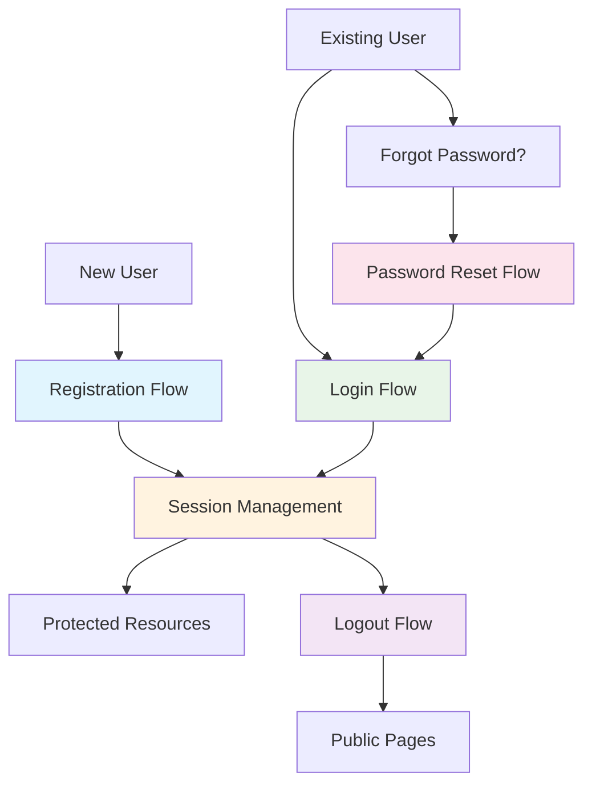

# Authentication Process - Techno Ambassador

> **Note**: This documentation has been reorganized into focused, smaller diagrams for better readability and maintainability.

## 📁 Organized Authentication Flows

The authentication process has been broken down into focused sequence diagrams located in the [`auth-process/`](auth-process/) directory:

### Core Flows

- **[Registration Flow](01-registration-flow.md)** - DJ account creation and email verification
- **[Login Flow](02-login-flow.md)** - User authentication and session establishment
- **[Session Management](03-session-management.md)** - Protected resources and token handling
- **[Password Reset Flow](04-password-reset-flow.md)** - Secure password recovery process
- **[Logout Flow](05-logout-flow.md)** - Session termination and cleanup

## Quick Overview

