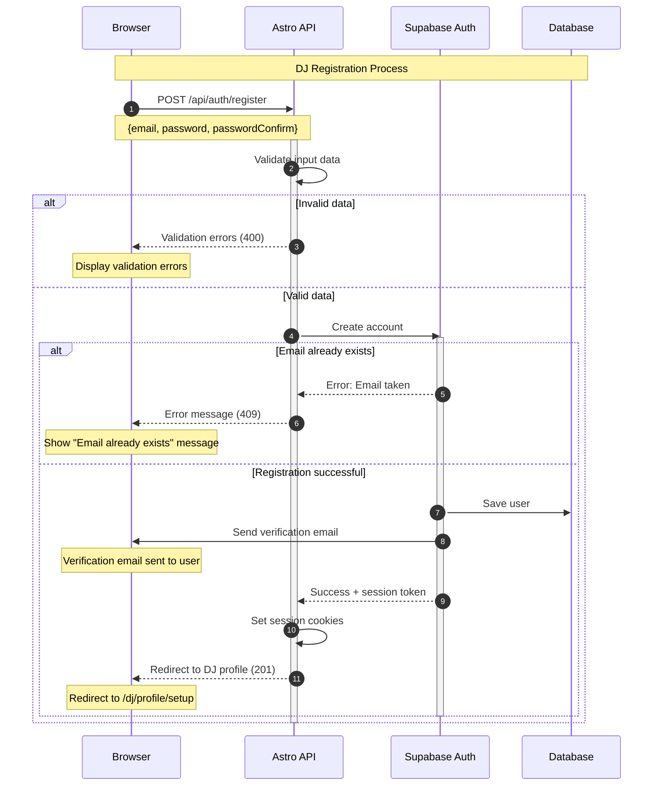

# DJ Registration Flow

This diagram shows the complete registration process for new DJs on the Techno Ambassador platform.

## Key Points

- **Validation**: Client-side and server-side validation for email format, password strength
- **Duplicate Prevention**: Checks for existing email addresses
- **Email Verification**: Automatic verification email sent after successful registration
- **Session Management**: Immediate session creation for seamless user experience
- **Error Handling**: Clear error messages for different failure scenarios
