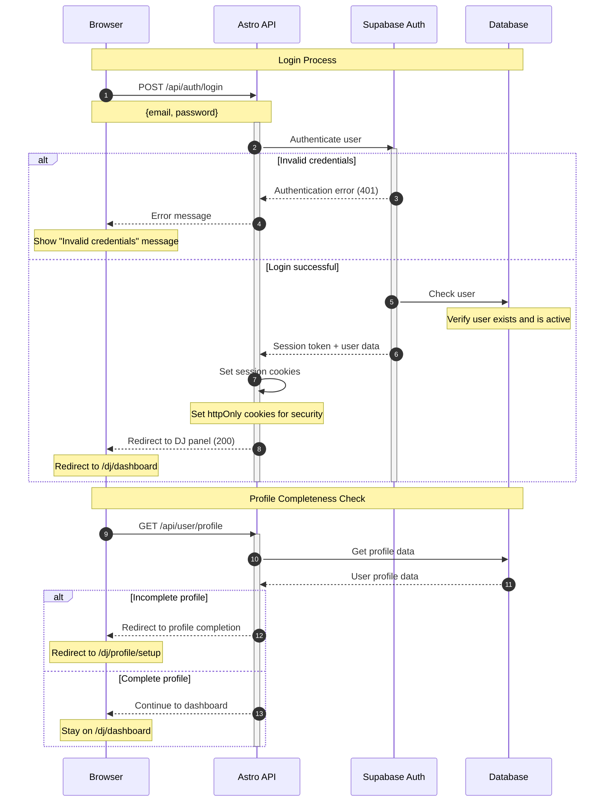

# DJ Login Flow

This diagram shows the authentication process for existing DJs logging into their accounts.

## Key Points

- **Credential Validation**: Secure password verification through Supabase Auth
- **Session Creation**: HttpOnly cookies for enhanced security
- **Profile Check**: Ensures user profile is complete before accessing dashboard
- **Error Handling**: Clear feedback for invalid login attempts
- **Automatic Redirect**: Smart routing based on profile completion status

## Security Features

- **HttpOnly Cookies**: Prevents XSS attacks on session tokens
- **Secure Transmission**: All authentication data sent over HTTPS
- **Rate Limiting**: Built-in protection against brute force attacks
- **Session Expiry**: Automatic token refresh and expiration handling
