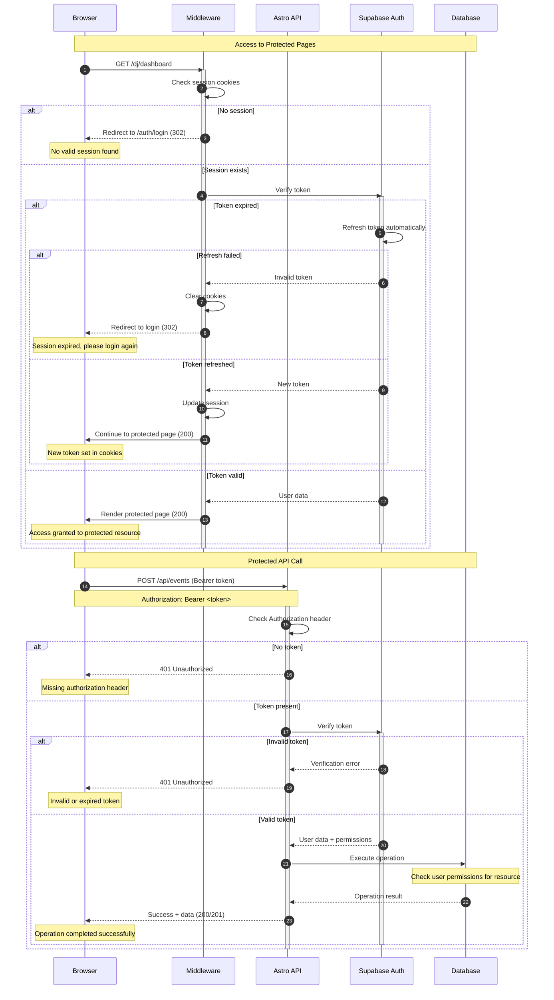

# Session Management & Protected Resources

This diagram shows how the system handles session validation and access to protected resources.

## Session Management Features

- **Automatic Token Refresh**: Seamless renewal of expired tokens
- **Cookie-based Sessions**: Secure HttpOnly cookies for web pages
- **Bearer Token API**: JWT tokens for API requests
- **Middleware Protection**: Server-side route protection
- **Graceful Expiry**: Clean redirect to login on session expiry

## Security Mechanisms

- **Token Validation**: Every request validates session authenticity
- **Permission Checking**: User permissions verified for each resource
- **Secure Storage**: Session data stored securely in browser cookies
- **CSRF Protection**: Built-in protection against cross-site request forgery
