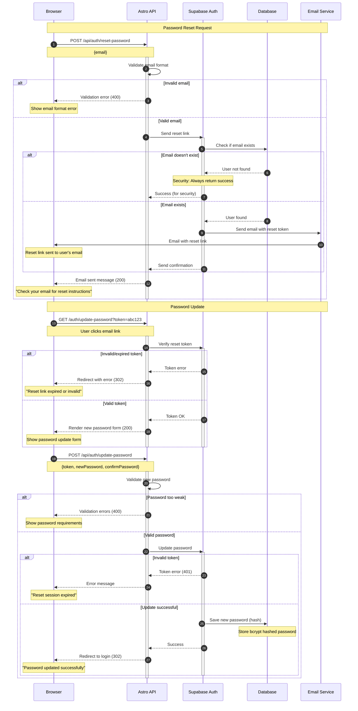

# Password Reset Flow

This diagram shows the complete password reset process for users who have forgotten their passwords.

## Security Features

- **Email Verification**: Reset links sent only to verified email addresses
- **Token Expiration**: Reset tokens expire after 1 hour for security
- **Rate Limiting**: Prevents spam reset requests from same IP/email
- **Secure Responses**: Always returns success even for non-existent emails
- **Password Validation**: Enforces strong password requirements

## Password Requirements

- Minimum 8 characters
- At least one uppercase letter
- At least one lowercase letter
- At least one number
- At least one special character
