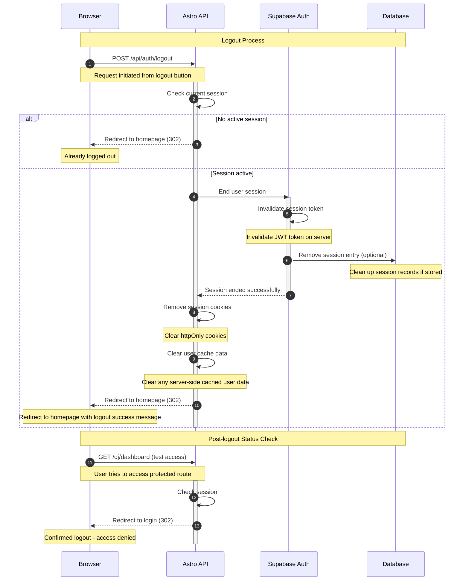

# Logout Flow

This diagram shows the process of securely logging out a user and cleaning up their session.

## Logout Security Features

- **Complete Session Cleanup**: Removes all traces of user session
- **Server-side Invalidation**: Tokens invalidated on Supabase Auth server
- **Cookie Removal**: All authentication cookies cleared from browser
- **Cache Cleanup**: Server-side user data cache cleared
- **Redirect Protection**: Automatic redirect to safe public page

## Client-side Cleanup

After successful logout, the client should also:

- Clear any user data from localStorage/sessionStorage
- Reset application state (Pinia stores)
- Clear any cached API responses
- Reset form states and user preferences

## Security Considerations

- **CSRF Protection**: Logout endpoint protected against cross-site attacks
- **Token Blacklisting**: Invalidated tokens cannot be reused
- **Session Fixation Prevention**: New session required for next login
- **Audit Logging**: Logout events logged for security monitoring
