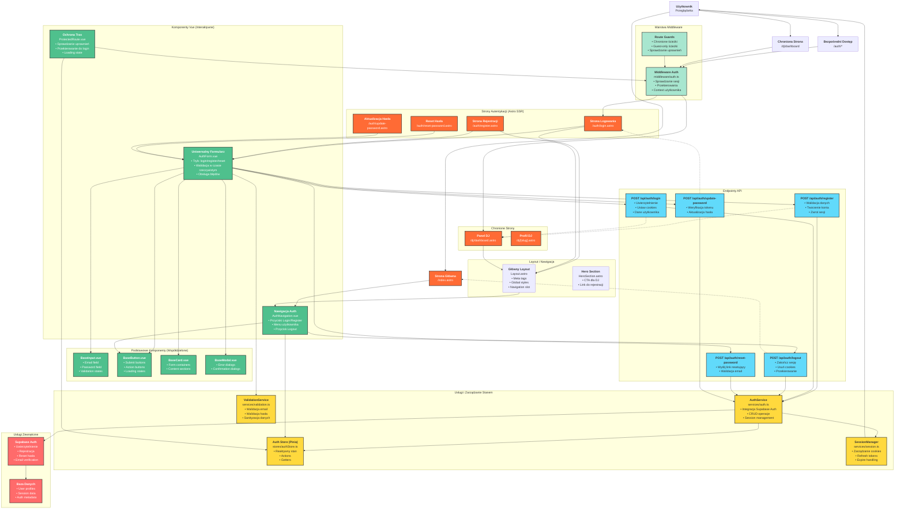

```mermaid
flowchart TD
    %% Main User Entry Points
    Browser["`**Użytkownik**
    Przeglądarka`"] --> HomePage["`**Strona Główna**
    /index.astro`"]
    Browser --> DirectAuth["`**Bezpośredni Dostęp**
    /auth/*`"]
    Browser --> ProtectedPage["`**Chroniona Strona**
    /dj/dashboard`"]

    %% Authentication Pages (Astro SSR)
    subgraph "Strony Autentykacji (Astro SSR)"
        LoginPage["`**Strona Logowania**
        /auth/login.astro`"]
        RegisterPage["`**Strona Rejestracji**
        /auth/register.astro`"]
        ResetPage["`**Reset Hasła**
        /auth/reset-password.astro`"]
        UpdatePage["`**Aktualizacja Hasła**
        /auth/update-password.astro`"]
    end

    %% Protected Pages
    subgraph "Chronione Strony"
        DJDashboard["`**Panel DJ**
        /dj/dashboard.astro`"]
        DJProfile["`**Profil DJ**
        /dj/[slug].astro`"]
    end

    %% Vue Components (Client-side)
    subgraph "Komponenty Vue (Interaktywne)"
        AuthNavigation["`**Nawigacja Auth**
        AuthNavigation.vue
        • Przyciski Login/Register
        • Menu użytkownika
        • Przycisk Logout`"]

        AuthForm["`**Uniwersalny Formularz**
        AuthForm.vue
        • Tryb: login/register/reset
        • Walidacja w czasie rzeczywistym
        • Obsługa błędów`"]

        ProtectedRoute["`**Ochrona Tras**
        ProtectedRoute.vue
        • Sprawdzanie uprawnień
        • Przekierowanie do login
        • Loading state`"]
    end

    %% Shared Base Components
    subgraph "Podstawowe Komponenty (Współdzielone)"
        BaseInput["`**BaseInput.vue**
        • Email field
        • Password field
        • Validation states`"]

        BaseButton["`**BaseButton.vue**
        • Submit buttons
        • Action buttons
        • Loading states`"]

        BaseCard["`**BaseCard.vue**
        • Form containers
        • Content sections`"]

        BaseModal["`**BaseModal.vue**
        • Error dialogs
        • Confirmation dialogs`"]
    end

    %% Layout and Navigation
    subgraph "Layout i Nawigacja"
        MainLayout["`**Główny Layout**
        Layout.astro
        • Meta tags
        • Global styles
        • Navigation slot`"]

        HeroSection["`**Hero Section**
        HeroSection.astro
        • CTA dla DJ
        • Link do rejestracji`"]
    end

    %% Middleware Layer
    subgraph "Warstwa Middleware"
        AuthMiddleware["`**Middleware Auth**
        middleware/auth.ts
        • Sprawdzanie sesji
        • Przekierowania
        • Context użytkownika`"]

        RouteGuards["`**Route Guards**
        • Chronione ścieżki
        • Guest-only ścieżki
        • Sprawdzanie uprawnień`"]
    end

    %% API Endpoints
    subgraph "Endpointy API"
        RegisterAPI["`**POST /api/auth/register**
        • Walidacja danych
        • Tworzenie konta
        • Zwrot sesji`"]

        LoginAPI["`**POST /api/auth/login**
        • Uwierzytelnienie
        • Ustaw cookies
        • Dane użytkownika`"]

        LogoutAPI["`**POST /api/auth/logout**
        • Zakończ sesję
        • Usuń cookies
        • Przekierowanie`"]

        ResetAPI["`**POST /api/auth/reset-password**
        • Wyślij link resetujący
        • Walidacja email`"]

        UpdateAPI["`**POST /api/auth/update-password**
        • Weryfikacja tokenu
        • Aktualizacja hasła`"]
    end

    %% Services and State Management
    subgraph "Usługi i Zarządzanie Stanem"
        AuthService["`**AuthService**
        services/auth.ts
        • Integracja Supabase Auth
        • CRUD operacje
        • Session management`"]

        AuthStore["`**Auth Store (Pinia)**
        stores/authStore.ts
        • Reaktywny stan
        • Actions
        • Getters`"]

        ValidationService["`**ValidationService**
        services/validation.ts
        • Walidacja email
        • Walidacja hasła
        • Sanityzacja danych`"]

        SessionManager["`**SessionManager**
        services/session.ts
        • Zarządzanie cookies
        • Refresh tokens
        • Expire handling`"]
    end

    %% External Services
    subgraph "Usługi Zewnętrzne"
        SupabaseAuth["`**Supabase Auth**
        • Uwierzytelnienie
        • Rejestracja
        • Reset hasła
        • Email verification`"]

        Database["`**Baza Danych**
        • User profiles
        • Session data
        • Auth metadata`"]
    end

    %% Main Flow Connections
    HomePage --> AuthNavigation
    DirectAuth --> AuthMiddleware
    ProtectedPage --> AuthMiddleware

    AuthMiddleware --> LoginPage
    AuthMiddleware --> DJDashboard

    %% Auth Pages to Components
    LoginPage --> AuthForm
    RegisterPage --> AuthForm
    ResetPage --> AuthForm
    UpdatePage --> AuthForm

    %% Component Dependencies
    AuthForm --> BaseInput
    AuthForm --> BaseButton
    AuthForm --> BaseCard
    AuthNavigation --> BaseButton

    %% Error Handling
    AuthForm --> BaseModal

    %% API Connections
    AuthForm --> RegisterAPI
    AuthForm --> LoginAPI
    AuthForm --> ResetAPI
    AuthForm --> UpdateAPI
    AuthNavigation --> LogoutAPI

    %% Service Layer Connections
    RegisterAPI --> AuthService
    LoginAPI --> AuthService
    LogoutAPI --> AuthService
    ResetAPI --> AuthService
    UpdateAPI --> AuthService

    AuthService --> SupabaseAuth
    AuthService --> SessionManager
    AuthForm --> ValidationService

    %% State Management
    AuthService --> AuthStore
    AuthNavigation --> AuthStore
    ProtectedRoute --> AuthStore

    %% External Service Connections
    SupabaseAuth --> Database
    SessionManager --> Browser

    %% Layout Integration
    LoginPage --> MainLayout
    RegisterPage --> MainLayout
    DJDashboard --> MainLayout
    MainLayout --> AuthNavigation

    %% Protection Flow
    ProtectedRoute --> AuthMiddleware
    RouteGuards --> AuthMiddleware

    %% Success Flows
    RegisterAPI -.-> DJDashboard
    LoginAPI -.-> DJDashboard
    LogoutAPI -.-> HomePage
    UpdateAPI -.-> LoginPage

    %% Styling
    classDef astroPage fill:#ff6b35,stroke:#333,stroke-width:2px,color:#fff
    classDef vueComponent fill:#4fc08d,stroke:#333,stroke-width:2px,color:#fff
    classDef apiEndpoint fill:#61dafb,stroke:#333,stroke-width:2px,color:#333
    classDef service fill:#ffd93d,stroke:#333,stroke-width:2px,color:#333
    classDef external fill:#ff6b6b,stroke:#333,stroke-width:2px,color:#fff
    classDef middleware fill:#a8e6cf,stroke:#333,stroke-width:2px,color:#333

    class LoginPage,RegisterPage,ResetPage,UpdatePage,DJDashboard,DJProfile,HomePage astroPage
    class AuthNavigation,AuthForm,ProtectedRoute,BaseInput,BaseButton,BaseCard,BaseModal vueComponent
    class RegisterAPI,LoginAPI,LogoutAPI,ResetAPI,UpdateAPI apiEndpoint
    class AuthService,AuthStore,ValidationService,SessionManager service
    class SupabaseAuth,Database external
    class AuthMiddleware,RouteGuards middleware
```
